# Контейнеризация (семинары)

## Урок 1. Механизмы пространства имен

### Изоляция на уровне файловой системы - chroot
Утилита **_chroot_** запускает команду или интерактивный терминал в указанной корневой директории.

- создадим директорию _testfolder_, которую будем передавать chroot в качестве параметра

    `mkdir ~/testfolder`

- создадим директорию _bin_, для исполняемых файлов

    `mkdir ~/testfolder/bin`

- скопируем исполняемый файл командной оболочки в директорию _bin_

    `cp /bin/bash ~/testfolder/bin/`

    Сам по себе исполняемый файл работать не сможет, поэтому помимо файла нужно еще скопировать необходимые ему библиотеки.

- для просмотра зависимостей воспользуемся утилитой **ldd**

    `ldd /bin/bash` 

    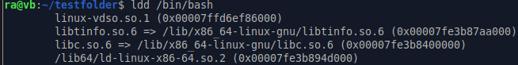

- создадим директории и скопируем зависимости

    ```
    mkdir ~/testfolder/lib ~/testfolder/lib64
    cp /lib/x86_64-linux-gnu/libtinfo.so.6 ~/testfolder/lib/
    cp /lib/x86_64-linux-gnu/libc.so.6 ~/testfolder/lib/
    cp /lib64/ld-linux-x86-64.so.2 ~/testfolder/lib64/
    ```

- после копирования необходимых файлов запустим **chroot**

    `sudo chroot ~/testfolder`

    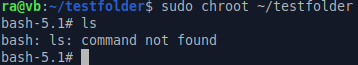

    Т.к. мы скопировали только **bash** вместе с зависимостями, мы не можем использовать другие утилиты.

- для добавления утилиты **ls**, посмотрим какие у неё зависимости с помощью **ldd**

    `ldd /bin/ls`

    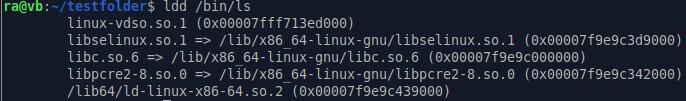

- скопируем файлы

    ```
    cp /bin/ls ~/testfolder/bin/
    cp /lib/x86_64-linux-gnu/libselinux.so.1 ~/testfolder/lib/
    cp /lib/x86_64-linux-gnu/libc.so.6 ~/testfolder/lib/
    cp /lib/x86_64-linux-gnu/libpcre2-8.so.0 ~/testfolder/lib/
    cp /lib64/ld-linux-x86-64.so.2 ~/testfolder/lib64/
    ```

- после того как необходимые файлы скопированы, запустим **chroot** и проверим **ls**

    `sudo chroot ~/testfolder`

    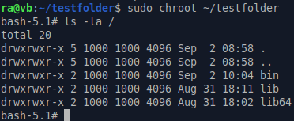

    Теперь мы можем использовать **ls** внутри **chroot**, по такому же принципу, можно добавить все необходимые утилиты.

### Изоляция на сетевом уровне - ip netns

Для управления сетевым пространством имён воспользуемся утилитой ip c параметром netns.

- для создания воспользуемся командой **ip netns add** и укажем имя

    `sudo ip netns add testns`

- после создания мы можем обращатся по имени к созданному пространству и передавать команды для исполнения

    `sudo ip netns exec testns bash`

    Эта команда запустит оболочку bash в указанном пространстве имён.

    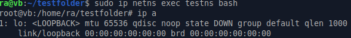

    После выполения команды **ip a** мы видим только один сетевой интерфейс loopback, что говорит нам о успешной сетевой изоляции.


### Изоляция на уровне процессов и сетевом уровне - unshare

Утилита **unshare** позволяет нам с помощью параметров создавать разные уровни пространств имён и запускать в этом окружении переданную в качестве аргумента программу, если её не передать запустится **/bin/sh**

- в качестве примера используем изоляцию на уровне сети и процессов

    `sudo unshare --net --pid --fork --mount-proc /bin/bash`

    После запуска мы можем проверить изоляцию сети через команду **ip a**, а изоляцию процессов через **ps aux**.

    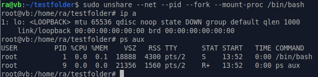

    Мы видим только один сетевой интерфейс, что показывает изоляцию на уровне сети, и только процессы запущенные внутри пространства имён, что показывает изоляцию на уровне процессов.

## Урок 2. Механизмы контрольных групп

### Подготовка системы для работы с lxc

- Установим необходимые утилиты для работы с lxc

    `sudo apt install lxc lxc-utils`

### Создание конейнера
- Для создания контейнера воспользуемся утилитой **lxc-create**  с параметрами

    `sudo lxc-create -t download -n test_container -- -d ubuntu -r bionic -a amd64`

- Проверим что контейнер создан утилитой **lxc-ls**

    `sudo lxc-ls -f`

    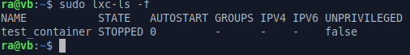

- Запустим его с помощью утилиты **lxc-start**

    `sudo lxc-start -n test_container`

    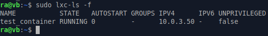

- После того как контейнер запущен, можно подключиться к оболочке утилитой **lxc-attach**

    `sudo lxc-attach -n test_container`

    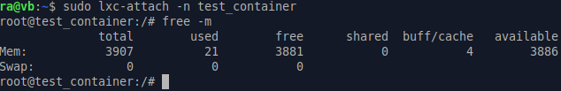


### Ограничение ресурсов контейнера на примере оперативной памяти

- Для ограничения ресурсов контейнера, можно воспользоваться конфигурационным файлом.

    `sudo vim /var/lib/lxc/test_container/config`

- Добавив параметр отвечающий за ограничение оперативной памяти.

    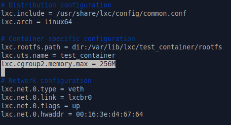

- Для применения настроек из конфигурационного файла, нужно перезапустить контейнер.

    ```
    sudo lxc-stop -n test_container
    sudo lxc-start -n test_container
    ```

- Теперь проверим оперативную память доступную в контейнере.

    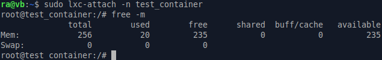

    Настройки из конфигурационного файла успешно применились.

### Настройка автозапуска контейнера

- Для включения автозапуска контейнера, нужно добавить соответствующий параметр в конфигурационный файл.

    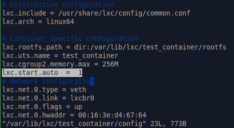

- После перезапуска можно увидеть изменённый флаг в статусе контейнера.

    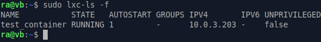

### Настройка логирования

- Для включения логирования нужно задать несколько параметров в конфигурационном файле.

    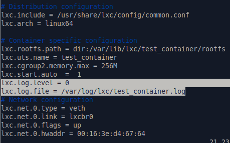

- Параметром **_lxc.log.level_** определяется уровень подробности логирования. Варианты:
    - 0 = trace
    - 1 = debug 
    - 2 = info
    - 3 = notice
    - 4 = warn
    - 5 = error
    - 6 = critical
    - 7 = alert
    - 8 = fatal

    Значение по умолчанию для этого парметра  равно 5.

- Параметром **_lxc.log.file_** задаётся файл, в который будет происходить запись.

    Для применения настроек, контейнер нужно перезапустить, и можно следить за изменениями в лог файле.

    `sudo tail -f /var/log/lxc/test_container.log`

## Урок 3. Введение в Docker

### Подготовка системы для работы с docker

### Управление контейнерами и образами с помощью утилиты docker

### Хранение данных в контейнерах docker
