# Контейнеризация (семинары)

## Урок 1. Механизмы пространства имен

### Изоляция на уровне файловой системы - chroot
Утилита **_chroot_** запускает команду или интерактивный терминал в указанной корневой директории.

- создадим директорию _testfolder_, которую будем передавать chroot в качестве параметра

    `mkdir ~/testfolder`

- создадим директорию _bin_, для исполняемых файлов

    `mkdir ~/testfolder/bin`

- скопируем исполняемый файл командной оболочки в директорию _bin_

    `cp /bin/bash ~/testfolder/bin/`

    Сам по себе исполняемый файл работать не сможет, поэтому помимо файла нужно еще скопировать необходимые ему библиотеки.

- для просмотра зависимостей воспользуемся утилитой **ldd**

    `ldd /bin/bash` 

    

- создадим директории и скопируем зависимости

    ```
    mkdir ~/testfolder/lib ~/testfolder/lib64
    cp /lib/x86_64-linux-gnu/libtinfo.so.6 ~/testfolder/lib/
    cp /lib/x86_64-linux-gnu/libc.so.6 ~/testfolder/lib/
    cp /lib64/ld-linux-x86-64.so.2 ~/testfolder/lib64/
    ```

- после копирования необходимых файлов запустим **chroot**

    `sudo chroot ~/testfolder`

    

    Т.к. мы скопировали только **bash** вместе с зависимостями, мы не можем использовать другие утилиты.

- для добавления утилиты **ls**, посмотрим какие у неё зависимости с помощью **ldd**

    `ldd /bin/ls`

    

- скопируем файлы

    ```
    cp /bin/ls ~/testfolder/bin/
    cp /lib/x86_64-linux-gnu/libselinux.so.1 ~/testfolder/lib/
    cp /lib/x86_64-linux-gnu/libc.so.6 ~/testfolder/lib/
    cp /lib/x86_64-linux-gnu/libpcre2-8.so.0 ~/testfolder/lib/
    cp /lib64/ld-linux-x86-64.so.2 ~/testfolder/lib64/
    ```

- после того как необходимые файлы скопированы, запустим **chroot** и проверим **ls**

    `sudo chroot ~/testfolder`

    

    Теперь мы можем использовать **ls** внутри **chroot**, по такому же принципу, можно добавить все необходимые утилиты.

### Изоляция на сетевом уровне - ip netns

Для управления сетевым пространством имён воспользуемся утилитой ip c параметром netns.

- для создания воспользуемся командой **ip netns add** и укажем имя

    `sudo ip netns add testns`

- после создания мы можем обращатся по имени к созданному пространству и передавать команды для исполнения

    `sudo ip netns exec testns bash`

    Эта команда запустит оболочку bash в указанном пространстве имён.

    

    После выполения команды **ip a** мы видим только один сетевой интерфейс loopback, что говорит нам о успешной сетевой изоляции.


### Изоляция на уровне процессов и сетевом уровне - unshare

Утилита **unshare** позволяет нам с помощью параметров создавать разные уровни пространств имён и запускать в этом окружении переданную в качестве аргумента программу, если её не передать запустится **/bin/sh**

- в качестве примера используем изоляцию на уровне сети и процессов

    `sudo unshare --net --pid --fork --mount-proc /bin/bash`

    После запуска мы можем проверить изоляцию сети через команду **ip a**, а изоляцию процессов через **ps aux**.

    

    Мы видим только один сетевой интерфейс, что показывает изоляцию на уровне сети, и только процессы запущенные внутри пространства имён, что показывает изоляцию на уровне процессов.

## Урок 2. Механизмы контрольных групп

### Подготовка системы для работы с lxc

- Установим необходимые утилиты для работы с lxc

    `sudo apt install lxc lxc-utils`

### Создание конейнера
- Для создания контейнера воспользуемся утилитой **lxc-create**  с параметрами

    `sudo lxc-create -t download -n test_container -- -d ubuntu -r bionic -a amd64`

- Проверим что контейнер создан утилитой **lxc-ls**

    `sudo lxc-ls -f`

    

- Запустим его с помощью утилиты **lxc-start**

    `sudo lxc-start -n test_container`

    

- После того как контейнер запущен, можно подключиться к оболочке утилитой **lxc-attach**

    `sudo lxc-attach -n test_container`

    


### Ограничение ресурсов контейнера на примере оперативной памяти

- Для ограничения ресурсов контейнера, можно воспользоваться конфигурационным файлом.

    `sudo vim /var/lib/lxc/test_container/config`

- Добавив параметр отвечающий за ограничение оперативной памяти.

    

- Для применения настроек из конфигурационного файла, нужно перезапустить контейнер.

    ```
    sudo lxc-stop -n test_container
    sudo lxc-start -n test_container
    ```

- Теперь проверим оперативную память доступную в контейнере.

    

    Настройки из конфигурационного файла успешно применились.

### Настройка автозапуска контейнера

- Для включения автозапуска контейнера, нужно добавить соответствующий параметр в конфигурационный файл.

    

- После перезапуска можно увидеть изменённый флаг в статусе контейнера.

    

### Настройка логирования

- Для включения логирования нужно задать несколько параметров в конфигурационном файле.

    

- Параметром **_lxc.log.level_** определяется уровень подробности логирования. Варианты:
    - 0 = trace
    - 1 = debug 
    - 2 = info
    - 3 = notice
    - 4 = warn
    - 5 = error
    - 6 = critical
    - 7 = alert
    - 8 = fatal

    Значение по умолчанию для этого парметра  равно 5.

- Параметром **_lxc.log.file_** задаётся файл, в который будет происходить запись.

    Для применения настроек, контейнер нужно перезапустить, и можно следить за изменениями в лог файле.

    `sudo tail -f /var/log/lxc/test_container.log`

## Урок 3. Введение в Docker

### Подготовка системы для работы с docker

- Проверим наличие утилиты **_docker_** в системе.

    `docker --version`

    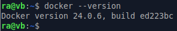

- Проверим что служба **_dockerd_** запущена и отвечает на запросы.

    `docker ps`

    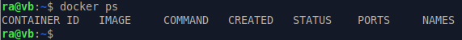

- в случае если после выполнения предыдущих команд вы видите ошибку, то можно воспользоваться официальной документацией по установке docker для вашего дистрибутива (https://docs.docker.com/engine/install/). 

### Управление контейнерами и образами с помощью утилиты docker

- для создания и запуска контейнера воспользуемся командой **_docker run_**

    `docker run hello-world`

    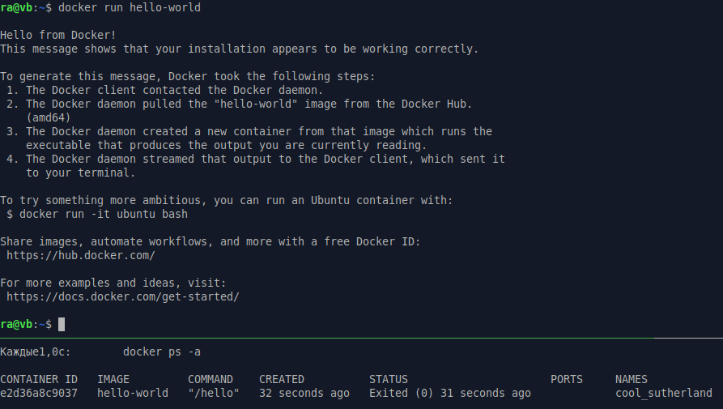

    Как видно на скриншоте, после создания и запуска контейнера, он выполнил приветствие и завершил свою работу.

- теперь создадим и запустим другой контейнер и подключимся к нему

    `docker run -it alpine`

    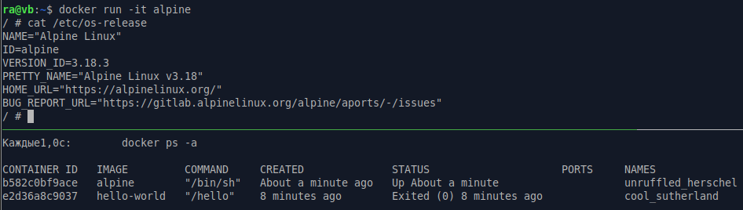

    После создания и запуска контейнера он не завершился, а остался работать, т.к. мы подключены к терминалу в интерактивном режиме, и можем выполнять различные команды(например **cat**)

- после выхода из консоли контейнера, он остановится, т.к. основной процесс в нашем случае оболочка **sh** завершил свою работу.

    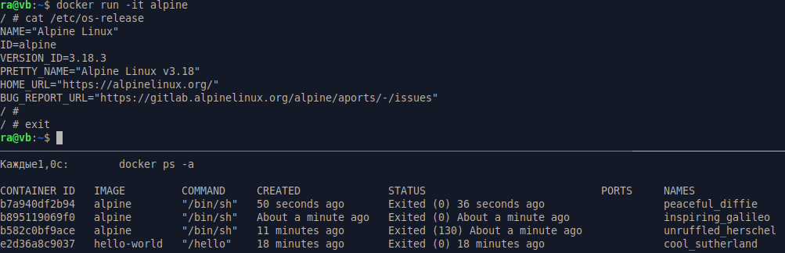

    Так же на скриншоте можно увидеть, что при каждом запуске **_docker run_** создаётся и запускается новый контейнер.

- в случае если мы хотим запустить уже существующий контейнер, то можно воспользоваться командой **_docker start_**, передав в качестве аргумента имя контейнера или его ID.

    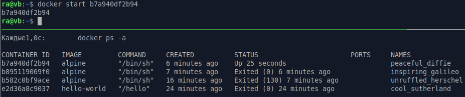

- для подключения к запущенному контейнеру можно воспользоваться командой **_docker exec_** и передав в качестве аргументов имя или ID контейнера, и команду которую мы хотим запустить, в нашем случае оболочку **_sh_**

    `docker exec -it b7a940df2b94 sh`

    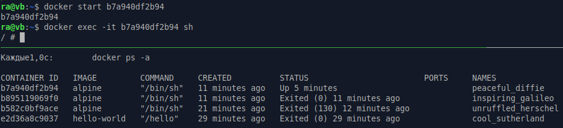

- для остановки контейнера воспользуемся командой **_docker stop_**, передав в качестве аргумента имя или ID контейнера.

    `docker stop b7a940df2b9`

    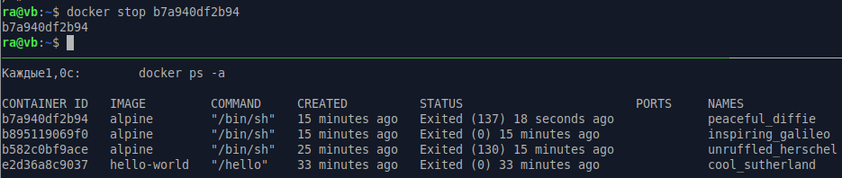

- для удаления контейнеров воспользуемся командой **_docker rm_**, передав в качестве аргумента имя или ID контейнера.

    `docker rm b7a940df2b94`

    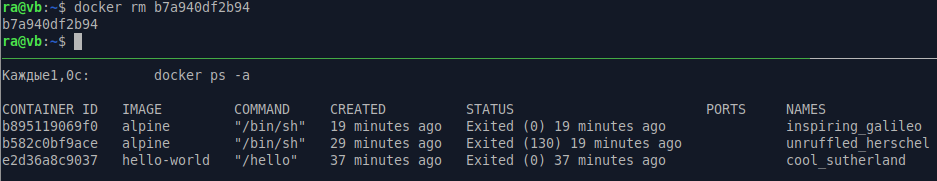

    В качестве аргументов команде **_docker rm_**, можно передать список элементов, например чтобы удалить все существующие контейнеры, можно воспользоваться следующей командой

    `docker rm $(docker ps -aq)`

    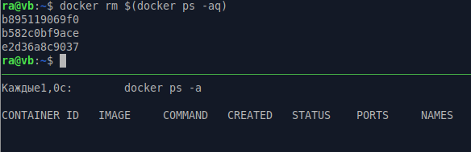

- для получения образа из репозитория docker, нужно выполнить команду **_docker pull_**, передав в качестве аргумента имя образа

    `docker pull nginx`

    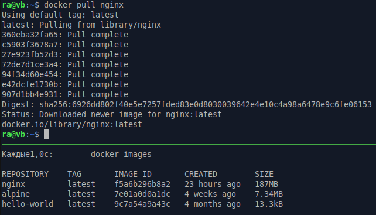

    Для просмотра загруженных образов можно использовать команду **_docker images_**


- для удаления образа можно использовать команду **_docker rmi_**, передав в качестве аргумента имя или ID образа

    `docker rmi nginx`

    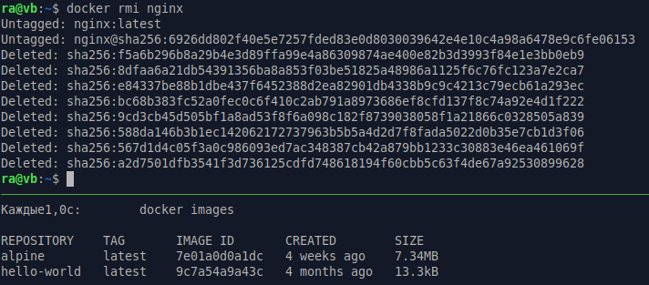

    **_docker rmi_** может принимать в качестве аргументов список ID, и для удаления всех образов можно воспользоваться следующей командой

    `docker rmi $(docker images -q)`

    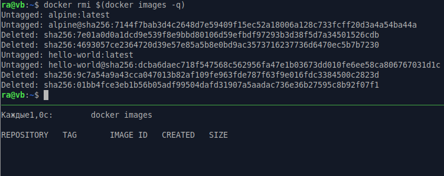

Здесь были рассмотрены далеко не все команды и параметры, с которыми может работать утилита **docker**, подробную информацию можно получить в документации, используя параметр **--help** вместе с интересующей утилитой, например:

```
docker --help
docker run --help
docker exec --help
docker pull --help
```

### Хранение данных в контейнерах docker

При создании контейнера, ему выделяется своя собственная файловая система, которая будет хранить информацию во время существования контейнера, а при его удалении будет стёрта.
Для того чтобы избежать потери данных предусмотрен механизм монтирования данных внутрь файловой системы контейнера.

- мы можем указать для монтирования любую существующую директорию, например, создадим директорию _testfolder_ и укажем её в качестве аргумента при создании контейнера

    `docker run -it -v ./testfolder:/folder_inside alpine`

    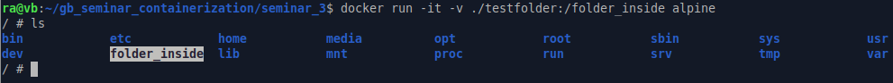

    Как видно на скриншоте, в файловой системе контейнера появилась новая директория.

- теперь мы можем работать с этой директорией изнутри контейнера, например создадим там файл и проверим, что мы можем его увидеть из хостовой системы

    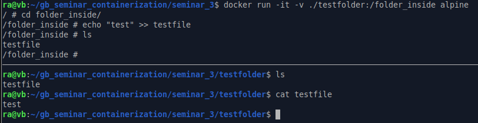

    В случае указания существующей точки монтирования внутри контейнера, эта директория будет заменена внешней.

    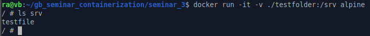

## Урок 4. Dockerfile и слои

### Синтаксис Dockerfile

Сам Dockerfile это набор инструкций которые будут выполнены для сборки образа.

- создадим файл с именем **_Dockerfile_**

    `touch Dockerfile`

- начнем c добавления базового образа с помощью инструкции **FROM**

    `FROM alpine`
    
    Если указать базовый образ без тега, будет использован тег **_latest_**, так же можно указать желаемую версию, например **_alpine:3.18_**

- инструкция **RUN** позволяет выполнить команду внутри контейнера, например, установить необходимые пакеты:

    `RUN apk update && apk --no-cache install bash`

    Т.к. каждая инструкция **RUN** добавляет слой изменений в образ, можно объединять команды с помощью **&&** для облегчения итогового образа.

- инструкция **WORKDIR** задаёт директорию выполнения команд.

    `WORKDIR /app`

    Эту инструкцию можно использовать несколько раз, если нужно выполнить команды в определённой директории.

- инструкция **COPY** позволяет скопировать данные из внешней файловой системы, нужно учесть что при сборке образа докер демон получит информацию только о текущем каталоге и подкаталогах, поднятся на уровень выше он не может. Т.е. нельзя указать в параметрах **COPY** путь **"../src"**.

    `COPY . /app`

    Эта команда скопирует все содержимое текущего каталога в папку **/app** внутри контейнера.
    На этом этапе следует учитывать, что докер демону передаётся вся информация из текущей директории, и если там есть данные не нужные для сборки контейнера, их можно перечислить в файле **.dockerignore**

- инструкция **CMD** позволяет задать выполнение команды, после создания контейнера на основе нашего образа

    `CMD ["bash"]`

    Так же можно задавать несколько аргументов, перечислив их через запятую.


- инструкция **ENTRYPOINT** позволяет задать команду, которая будет являтся точков входа, и которой можно будет передать внешние аргументы при запуске.

    `ENTRYPOINT ["bash"]`

Эте далеко не полный список инструкций, но его должно хватить для начального знакомства с построением образов. Более подробную информацию лучше получить в официальной документации (https://docs.docker.com/engine/reference/builder/).

### Добавление Dockerfile к существующему проекту

В качестве примера я буду использовать следующий проект:
https://github.com/RomanAnnenkov/GB_oop_calculator.git

- т.к следует ограничить видимость проекта при сборке, стоит начать с создания **.dockerignore** файла

    `touch .dockerignore`

    И добавления в него элементов которые будут исключены из зоны видимости docker

    ```
    **/.idea/
    *.md
    *.log
    **/target/
    **/logs/
    ```
- создаем Dockerfile, расположив его в корне проекта

    `touch Dockerfile`

    Чтобы исключить влияние внешней среды на сборку, и вместе с этим получить легковесный контейнер без лишних пакетов, разделим файл на два логических этапа:

    - создание образа сборщика, в который будут добавлены пакеты для компиляции приложения, и выполнения сборки проекта там

        `FROM alpine:3.18 AS builder`

        Задаем базовый образ, и через **AS** задаю имя, по которму смогу потом к нему обратиться 

        `RUN apk update && apk --no-cache add openjdk17-jdk=17.0.8_p7-r0 maven=3.9.2-r0`

        Обновляем списки пакетов, и устанавливаем необходимые для сборки с указанием версий.

        `COPY . .`

        Копируем файлы проекта в текущую директорию образа. 

        `RUN mvn package`

        Запускаем сборку проекта в текущей директории.

    - создание образа со средой выполнения, и копирование туда скомпилированного кода из сборщика

        `FROM alpine:3.18`

        Задаем базовый образ, для построения контейнера.

        `RUN apk update && apk --no-cache add openjdk17-jre=17.0.8_p7-r0`

        Обновляем и устанавливаем пакеты для исполнения приложения.

        `COPY --from=builder /target/*jar-with-dependencies.jar /app/app.jar`

        Копируем скомпилированный файл в папку внутри образа.

        `WORKDIR /app`

        Задаем рабочую директорию для выполения команд.

        `RUN mkdir logs && chown 1000:1000 logs`

        Создаем папку **logs** и переназначаю права, для возможности работы от непривилегированного пользователя.

        `CMD ["java", "-jar", "app.jar"]`

        Задаем команду для выполнения приложения в контейнере

- запускаем сборку образа

    `docker build -t calculator .`

- после завершения сборки запускаем контейнер с приложением

    `docker run -i -u 1000 -v ./logs:/app/logs calculator`

    В команде запуска задаём параметр **"-i"** т.к. приложение консольное и для работы понадобится интерактивный режим, задаем пользователя, для работы в непривелигированном режиме параметром **"-u 1000"**, так же в приложении используется логирование в файл, поэтому добавим монтирование директории **"-v ./logs:/app/logs calculator"**

    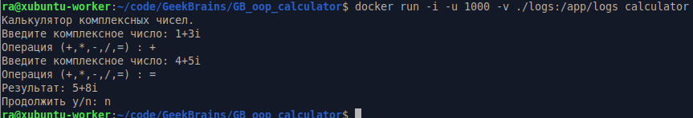